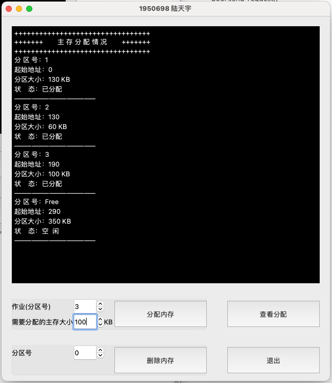
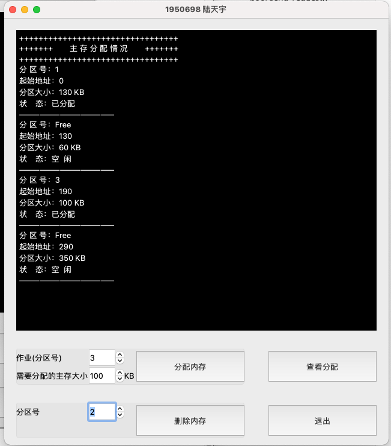

# 内存管理大作业 

>  动态分区分配方式的模拟<br>1950698 陆天宇<br>

## 项目背景及需求

假设初始态下，可用内存空间为640K，并有下列请求序列，请分别用`首次适应算法`和`最佳适应算法`进行内存块的分配和回收，并显示出每次分配和回收后的空闲分区链的情况来。


## 开发/运行环境

环境：Windows 10/Big sur

语言：C++/Clang 64bit/Qt 6.1.0


## 动态分区分配算法

`首次适应算法（First-fit）`：当要分配内存空间时，就查表，在各空闲区中查找满足大小要求的可用块。只要找到第一个足以满足要球的空闲块就停止查找，并把它分配出去；如果该空闲空间与所需空间大小一样，则从空闲表中取消该项；如果还有剩余，则余下的部分仍留在空闲表中，但应修改分区大小和分区始址。

`最佳适应算法（Best-fit）`：当要分配内存空间时，就查找空闲表中满足要求的空闲块，并使得剩余块是最小的。然后把它分配出去，若大小恰好合适，则直按分配；若有剩余块，则仍保留该余下的空闲分区，并修改分区大小的起始地址。

`内存回收：`将释放作业所在内存块的状态改为空闲状态，删除其作业名，设置为空。并判断该空闲块是否与其他空闲块相连，若释放的内存空间与空闲块相连时，则合并为同一个空闲块，同时修改分区大小及起始地址。


## 系统架构

项目包含两个类：首页类`memIndex`和内存管理类`memManage`，每个类均有自己的界面实现。程序运行后，实例化一个`memIndex`类，选择使用的算法之后，实例化对应的算法模拟窗口。包括了内存分配，内存回收和查看分配。

具体实现效果请看release文件夹中的可执行文件。本文档及软件写于mac os，windows下可能界面有所出入。

### memIndex类

> 程序主窗口，继承自`QWidget`类

 

1. `on_pushButton_clicked`：运行首次适应算法模拟
2. `on_pushButton_2_clicked()`：运行最佳适应算法模拟

```c++
void on_pushButton_clicked();//首次适应算法模拟
void on_pushButton_2_clicked();//最佳适应算法模拟
```

### memManage类

> 模拟器窗口，继承自`QWidget`类

 

1. `block_first`：表示指向用于模拟的双向链表的头结点

2. `block_last`：表示指向用于模拟的双向链表的尾结点

3. `memAlloc`：分配内存

4. `memFree`：回收内存

5. `view`：显示内存分配情况

   

## 算法实现

### 首次适应算法（First-fit）

找到能插进去的链表位置，然后把结点拆开插进去。

```c++
//------------------ 首次适应算法 -----------------------
Status memManage::First_fit(int ID,int request)//传入作业名及申请量
{
    //为申请作业开辟新空间且初始化
    auto temp=new DuLNode;
    temp->data.ID=ID;
    temp->data.size=request;
    temp->data.state=Busy;

    DuLNode *p=block_first->next;
    while(p)
    {
        if(p->data.state==Free && p->data.size==request)
        {//有大小恰好合适的空闲块
            p->data.state=Busy;
            p->data.ID=ID;
            delete temp;
            return OK;
        }
        if(p->data.state==Free && p->data.size>request)
        {//有空闲块能满足需求且有剩余"
            temp->prior=p->prior;
            temp->next=p;
            temp->data.address=p->data.address;
            p->prior->next=temp;
            p->prior=temp;
            p->data.address=temp->data.address+temp->data.size;
            p->data.size-=request;
            return OK;
        }
        p=p->next;
    }
    delete temp;
    return ERROR;
}
```

### 最佳适应算法（Best-fit）

找到能插进去的最佳链表位置（容量大于等于申请大小的最小的那个链表结点），然后把结点拆开插进去。

```c++
//--------------------  最佳适应算法  ------------------------
Status memManage::Best_fit(int ID,int request)//传入作业名及申请量
{
    int ch; //记录最小剩余空间
    auto temp=new DuLNode;
    temp->data.ID=ID;
    temp->data.size=request;
    temp->data.state=Busy;
    DuLNode *p=block_first->next;
    DuLNode *q= nullptr; //记录最佳插入位置
    while(p) //初始化最小空间和最佳位置
    {
        if(p->data.state==Free &&
            (p->data.size>request || p->data.size==request) )
        {
            q=p;
            ch=(int)p->data.size-request;
            break;
        }
        p=p->next;
    }
    while(p)
    {
        if(p->data.state==Free && p->data.size==request)
        {//空闲块大小恰好合适
            p->data.ID=ID;
            p->data.state=Busy;
            delete temp;
            return OK;
        }
        if(p->data.state==Free && p->data.size>request)
        {//空闲块大于分配需求
            if(p->data.size-request<ch)//剩余空间比初值还小
            {
                ch=(int)p->data.size-request;//更新剩余最小值
                q=p;//更新最佳位置指向
            }
        }
        p=p->next;
    }
    if(q == nullptr){delete temp; return ERROR;}//没有找到空闲块
    else
    {//找到了最佳位置并实现分配
        temp->prior=q->prior;
        temp->next=q;
        temp->data.address=q->data.address;
        q->prior->next=temp;
        q->prior=temp;
        q->data.address+=request;
        q->data.size=ch;
        return OK;
    }
}
```

## 运行测试

1. 作业1申请130K

    

2. 作业2申请60K

    

3. 作业3申请100k

    

4. 作业2释放60K

    

篇幅所限，后不贴图。

